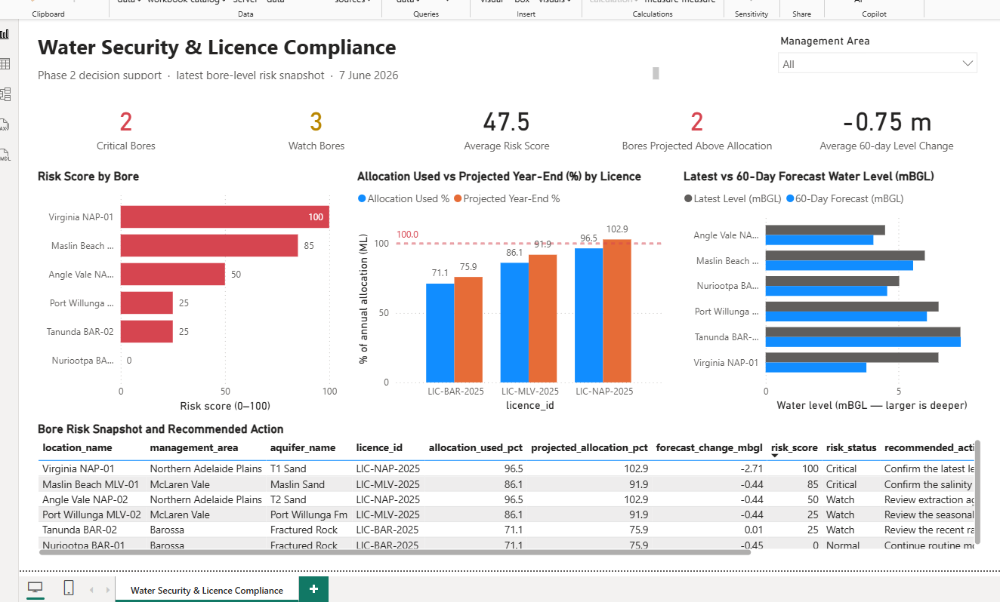

# AquaSentry: Multi-Aquifer Groundwater Monitoring & Forecasting

**Power BI · Azure SQL · Azure Data Factory · Power Query/M**

A portfolio project for monitoring groundwater level and salinity across several
management areas. It pulls together Azure infrastructure, Python data
processing, Power BI reporting, statistical anomaly detection, machine learning
experiments and a local OPC-UA HMI demo.

[](https://github.com/danakim1004au-prog/azure-water-quality-pipeline/actions/workflows/ci.yml)




> **Water Security & Licence Compliance dashboard.** Bore level risk scores,
> licence allocation projections and 60-day water level forecasts in one
> management view. The page is committed as PBIP source, and it carries its
> demonstration rows inline so it opens without an Azure subscription.

---

## Overview

The project loads groundwater level, salinity and rainfall into one data model
for surveillance, trend analysis and reporting. Three rule-based detectors flag
rapid level changes, weak recharge responses and sustained salinity increases.
Separate machine-learning experiments look at future water levels and unusual
combinations of readings.

There are two Power BI artefacts. The four-page operational report reads Azure
SQL over DirectQuery. The Water Security page is committed as PBIP source with
its demonstration rows embedded, so it renders for anyone who clones the
repository. [`docs/power-query.md`](docs/power-query.md) sets out how each one
is built and what separates them.

The database behind the DirectQuery report holds a generated demonstration
dataset of six bores and three known anomaly scenarios. Public-source ingestion
clients are included, but live API validation and reconciliation are still
future work.

## Project scope

| Area | Current scope |
|---|---|
| **Monitoring dataset** | 6 bores, 3 management areas, 4 aquifers, roughly 3 years of daily demonstration data |
| **Forecast evaluation** | 30-day MAE of 0.203 m against a 0.208 m persistence baseline, with stronger gains at longer horizons |
| **Anomaly detection** | 3 documented statistical detectors and an Isolation Forest evaluated against injected scenarios |
| **Decision support** | Bore-level risk status combining forecast range, licence use, anomaly context, data completeness and a recommended action |
| **Azure and reporting** | Terraform-provisioned Azure resources, demonstration data in Azure SQL, a four-page DirectQuery report and a Water Security page committed as PBIP source |
| **Quality checks** | 18 automated tests covering detector behaviour, regional rainfall, time-series splitting, ML preparation, risk scoring and HMI startup |

## Project status

This is a portfolio implementation, not a standing production system.

| Component | Status |
|-----------|--------|
| Rule-based anomaly detection | Implemented, tested and packaged as a 06:00 UTC timer-triggered Azure Function |
| ML forecasting and Isolation Forest | Implemented and tested offline. Cloud inference is not deployed |
| Decision support | Licence compliance, 60-day projection and bore-level risk snapshot implemented |
| Power BI operational report | Four pages built with DirectQuery against the demonstration Azure SQL database. Not yet in source control |
| Power BI Water Security page | Committed as PBIP. Runs on embedded demonstration rows, so it is not wired to the database |
| SCADA HMI | Runs locally over OPC-UA and WebSocket with simulated process values |
| Core Azure infrastructure | Provisioned through Terraform |
| SQL, ADF and Logic App artefacts | Supplied separately from Terraform. Runtime configuration is still required |
| Live public-source ingestion | Clients implemented. Live endpoint validation is still outstanding |

---

## Dashboard

The four-page Power BI report supports operational review across management
areas. It uses DirectQuery, so visuals query the Azure SQL database instead of
an imported Power BI dataset.

**Operational overview.** Current status by bore and management area, with KPI
cards and a location map.

**Data model.** `monitoring_wells` and a `Date` dimension linked to the
water-level, rainfall and anomaly fact tables.


**Groundwater trend and rainfall.** Water level and its 7-day moving average,
shown with daily and 7-day cumulative rainfall. Higher mBGL values mean a deeper
water table and sit lower on the chart.


**Risk review.** Rainfall versus water level, plus a per-bore table showing the
latest Normal, Watch or Critical classification.


---

## How it works

The diagram below shows the intended cloud workflow. Azure infrastructure, Azure
SQL loading and Power BI DirectQuery are implemented. Publishing the ADF
artefacts, deploying cloud ML scoring and connecting the Logic App notifications
are planned extensions.

```
[ Public data sources ]
 Groundwater REST API (levels + salinity) ──┐
 Climate API (daily rainfall)               ├─► Azure Data Factory ─► Azure SQL Database
 Surface-water portal (river/reservoir)     ┘     (daily ETL)              │
                                                                           │
                              Azure Function (daily 06:00 UTC timer) ──────┤
                              · rule-based detectors → anomaly_events      │
                              · ML forecast + Isolation Forest (offline;   │
                                cloud inference planned)                   │
                                                          │
                                              Azure SQL · anomaly_events
                                                          │
                                   ┌──────────────────────┴───────────────────────┐
                                   ▼                                               ▼
                          Power BI dashboard                       Logic Apps → Email / Teams
                       (DirectQuery to Azure SQL)              (workflow defined; connectors TBC)
```

| Layer | Technology | Repository status |
|-------|-----------|-------------------|
| Infrastructure | **Terraform** | Provisions the resource group, storage, Azure SQL, Data Factory, Function App and Key Vault |
| Ingestion | **Python** (requests, pandas, SQLAlchemy) | Source clients and idempotent SQL loaders implemented. Live API validation pending |
| Orchestration | **Azure Data Factory** | 05:00 UTC trigger and deployable artefacts included. Azure Batch and staging configuration are required |
| Storage | **Azure SQL Database** | Schema, reporting views, licence allocation, extraction and risk snapshot tables implemented |
| Analytics | **Azure Functions, scikit-learn, pandas** | 06:00 UTC rule-based Function, offline ML experiments and decision-support scoring implemented |
| Secrets | **Azure Key Vault** | SQL connection string accessed by the Function through managed identity |
| Alerting | **Azure Logic Apps** | Workflow definition included. Email and Teams connector configuration pending |
| Visualisation | **Power BI** (DirectQuery) | Four-page report connected to the demonstration database |
| CI/CD | **GitHub Actions** | Python linting, unit tests, Terraform formatting and validation |

---

## Analytics

### Rule-based detection

The rule-based layer records a threshold and a plain-language reason for each
event. The thresholds support this demonstration and would need calibrating
against operational requirements before production use. Methodology:
[`docs/anomaly_methodology.md`](docs/anomaly_methodology.md).

| Detector | Signal | Method |
|----------|--------|--------|
| **Rapid Level Change** | Sudden water-level movement | Z-score against a trailing 7-day baseline (±2σ → WARNING, ±3σ → CRITICAL) |
| **Low Recharge Response** | Limited rebound after rain | After a 7-day rainfall total above 20 mm, check for a rise of at least 0.10 m within 14 days |
| **Salinity Intrusion Risk** | Sustained increase in TDS | OLS trend over 30 days (slope above 1 mg/L/day, R² ≥ 0.5). Coastal bores are classified as CRITICAL |

### Forecasting and machine learning

The ML modules are evaluated offline on the committed demonstration data.
Implementation details: [`ml/README.md`](ml/README.md).

**Groundwater-level forecast.** A gradient-boosted regressor predicts the future
water level from lagged levels, trailing rainfall, salinity and seasonal
features. Training and testing are separated chronologically, with a purge gap
between them. Results are compared with a persistence baseline.

| Horizon | Model MAE | Persistence MAE | Improvement |
|--------:|----------:|----------------:|------------:|
| 7 days  | 0.138 m   | 0.124 m         | -11.5%      |
| 30 days | 0.203 m   | 0.208 m         | **+2.2%**   |
| 60 days | 0.234 m   | 0.304 m         | **+22.8%**  |

At seven days, persistence wins. The two are close at 30 days, and the model
pulls ahead at the longer test horizon on this generated dataset.


**Unsupervised anomaly detection.** An Isolation Forest scores level, salinity,
rates of change and rainfall features using a 1% contamination setting. It does
not use manually defined hydrogeological thresholds. The injected scenarios give
a repeatable check of the scoring pipeline rather than evidence of performance
on operational data.

---

## Decision support and licence compliance

A bore-level risk snapshot built for regional surveillance, licence compliance
review and management reporting. It combines:

- the latest groundwater level and a 60-day trend projection
- an 80% projection interval for forecast uncertainty
- annual licence allocation, extraction to date and projected year-end use
- the latest rule-based anomaly and 30-day data completeness
- a 0-100 risk score, a Normal / Watch / Critical status, the risk drivers
  behind it and a recommended action

Rainfall is mapped to the relevant groundwater management area instead of
averaged across all three stations. The committed data generator uses a fixed
reference date, so the dataset and reported results reproduce exactly.

The report is version-controlled as a Power BI Project (PBIP) under
[`powerbi/WaterSecurityPhase2/`](powerbi/WaterSecurityPhase2/), so the semantic
model (`vw_water_security_risk`, `vw_licence_compliance`) and page layout are
reviewable as source rather than a binary `.pbix`. Measures and relationships
show up in a diff the same way Python does.

That model holds its rows inline rather than querying the database, which is
what lets the page render on a fresh clone. It also means the figures only move
when someone regenerates them.
[`docs/power-query.md`](docs/power-query.md) lists the seven column names that
would need aligning to point the model at the views instead.

The scoring itself runs against SQL. The implementation writes
[`sample_data/water_security_risk.csv`](sample_data/water_security_risk.csv) and
loads it into `monitoring.water_security_risk_snapshots`, which
`monitoring.vw_water_security_risk` exposes as the latest snapshot per bore and
`monitoring.vw_licence_compliance` summarises by licence. The same measures are
kept as plain text in
[`powerbi/phase2_water_security_measures.dax`](powerbi/phase2_water_security_measures.dax).
The licence and extraction values are demonstration scenarios, not regulatory
records.

```bash
python scripts/generate_sample_data.py
python scripts/run_detectors_offline.py
python analytics/water_security_risk.py
```

---

## Azure implementation

Terraform provisions the Azure resource group, Azure SQL Database, Data Factory,
Function App, storage account and Key Vault. The demonstration dataset was
loaded into Azure SQL and queried by Power BI through DirectQuery. The images
below are from the implemented Azure environment.


---

## SCADA HMI demonstration

The repository also includes a local web-based HMI that places ML outputs and
rule-based alerts beside process tags. It shows how the batch analytics could be
presented in an operational interface.

The OPC-UA server and client use an OPC-UA subscription with data-change
notifications. The process values are simulated from the demonstration data. No
field sensors or production control system are connected.

```
OPC-UA server (PLC/RTU stand-in) ──opc.tcp──► client subscription ──► FastAPI HMI ──WebSocket──► browser
 6 bores × {level, TDS, pump, valve}          data-change cache          ML and alert context
```

- **Monitor.** The server exposes one object per bore and the client subscribes
  to level, TDS, pump and valve tags.
- **Analyse.** The HMI shows the 30-day forecast and Isolation Forest score
  beside the current OPC-UA values.
- **Control pathway.** Pump and valve nodes are writable in the simulator. No
  operator command workflow is implemented.

The full design and production considerations are in
[`scada_hmi/SCADA_HMI_REPORT.md`](scada_hmi/SCADA_HMI_REPORT.md).

The generated ML CSVs stay outside version control. Create them locally before
starting the HMI:

```bash
pip install -r requirements.txt
pip install -r scada_hmi/requirements.txt
python ml/forecast_train.py
python ml/anomaly_unsupervised.py
python scada_hmi/opcua_server.py      # terminal 1
python scada_hmi/hmi_server.py        # terminal 2; open http://localhost:8080
```

---

<details>
<summary><b>Run the analytics offline</b></summary>

```bash
pip install -r requirements.txt
python scripts/generate_sample_data.py      # generate the demonstration dataset
python scripts/run_detectors_offline.py     # rule-based detectors
python ml/forecast_train.py                 # train and evaluate the level forecast
python ml/anomaly_unsupervised.py           # multivariate anomaly scoring
python analytics/water_security_risk.py     # risk and licence-compliance snapshot
pytest tests/ -v                            # 18 tests
```

For the cloud setup, see [`infra/README.md`](infra/README.md) and the
[deployment section](docs/PROJECT_REPORT.md#azure-deployment). The estimated cost
of the demonstrated configuration is roughly AUD 5 to 10 per month.
</details>

<details>
<summary><b>Data sources and provenance</b></summary>

| Designed source | Data | Licence |
|-----------------|------|---------|
| State groundwater portal (WaterConnect) | Drillhole water levels (mBGL) and salinity (TDS) | Creative Commons Attribution |
| National climate service (SILO) | Daily rainfall by station | Open / Creative Commons |
| Surface-water portal | River and reservoir levels | Open |

The ingestion layer is designed around these public sources. The current
dashboard and Azure database use a schema-compatible generated dataset from
[`scripts/generate_sample_data.py`](scripts/generate_sample_data.py). Its bore
identifiers and readings are representative demonstration values, not observed
measurements. Three scenarios exercise the detector logic: a rapid level change,
a limited recharge response and a coastal salinity trend. The dataset also
includes representative licence allocation and metered-extraction scenarios for
decision-support testing.

Live use requires validation of endpoint response fields, drillhole and station
identifiers, attribution requirements and reconciliation against the source
systems. Further detail is in
[`docs/PROJECT_REPORT.md`](docs/PROJECT_REPORT.md#data-provenance).
</details>

<details>
<summary><b>Repository structure</b></summary>

```
azure-water-quality-pipeline/
├── infra/            # Terraform infrastructure
├── ingestion/        # Public-source clients and Azure SQL loaders
├── functions/        # Azure Function for rule-based anomaly detection
├── ml/               # Forecasting and Isolation Forest experiments
├── analytics/        # Water-security risk and licence-compliance scoring
├── adf/              # Data Factory linked services, pipeline and trigger definitions
├── logic_apps/       # Critical-event alert workflow definition
├── sql/              # Schema, views, audit table and stored procedures
├── powerbi/          # PBIP report source, dashboard screenshots and DAX measures
├── scada_hmi/        # OPC-UA server/client and FastAPI HMI demonstration
├── scripts/          # Sample-data generation and deployment helpers
├── tests/            # Detector, ML, risk and HMI tests
├── docs/             # Project report, anomaly methodology, support runbook, Power Query layer
└── .github/          # CI and manual deployment workflows
```
</details>

---

[Project report](docs/PROJECT_REPORT.md) ·
[Detection methodology](docs/anomaly_methodology.md) ·
[Support runbook](docs/runbook.md) ·
[Power Query / M layer](docs/power-query.md) ·
[Machine learning notes](ml/README.md)
