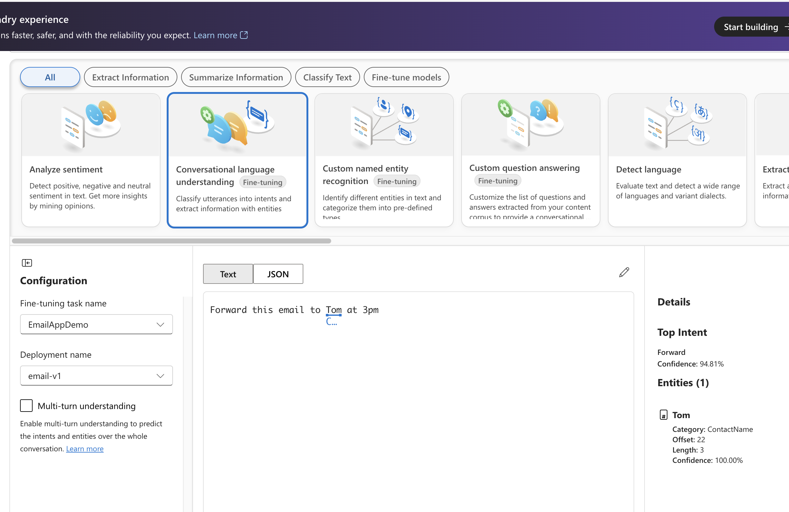
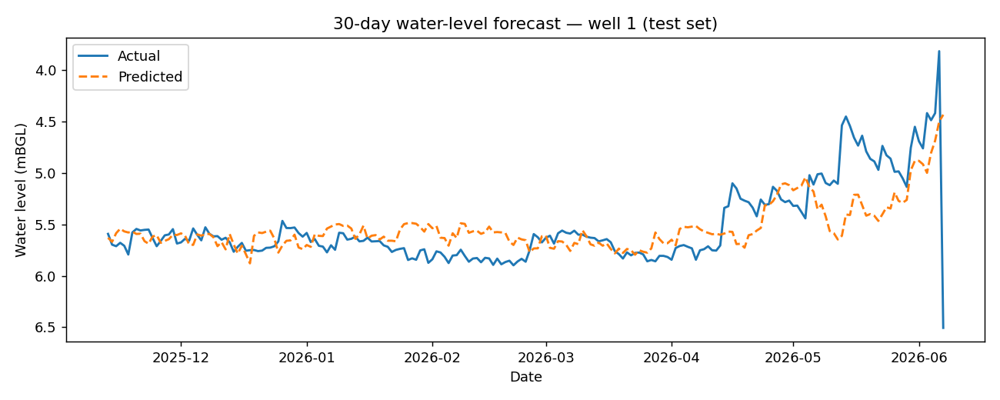

# AquaSentry — Multi-Aquifer Groundwater Monitoring & Forecasting

**Monitors groundwater bores across three management areas of the Adelaide
region — the Northern Adelaide Plains, the Barossa and the McLaren Vale coast —
forecasts supply pressure a month ahead, and surfaces critical anomalies the
moment they appear.** An end-to-end Azure pipeline that turns public
environmental data into decisions on a live Power BI dashboard.

[](https://github.com/danakim1004au-prog/azure-water-quality-pipeline/actions/workflows/ci.yml)




---

## Overview

Groundwater is slow-moving and easily degraded: by the time a problem is
obvious in a single reading, the underlying trend is usually well established.
AquaSentry continuously ingests public groundwater, rainfall and surface-water
data, scores it for the failure modes that matter — over-extraction, stalled
recharge, saline intrusion — **and forecasts where each bore is heading**, so
operators can act before a constraint becomes a crisis rather than after.

The emphasis throughout is **explainability and data integrity**: every figure
traces back to a source reading, every rule-based alert to a documented
threshold, and every model to a leakage-safe evaluation against a held-out
future.

## Key results

| | |
|---|---|
| **Monitoring scope** | 6 bores · 3 management areas (Northern Adelaide Plains, Barossa, McLaren Vale) · 4 distinct aquifers · ~3 years of daily readings |
| **Forecast skill** | Month-ahead level forecast at 0.20 m MAE; **+25 % over a naive baseline at the 60-day horizon** |
| **Anomaly detection** | 3 explainable detectors **plus** an Isolation Forest that independently rediscovers injected faults |
| **Cloud & quality** | Full stack as Terraform IaC · live Power BI **DirectQuery** to Azure SQL · **12 unit tests** green in CI |

---

## Dashboard

A four-page Power BI report on **DirectQuery**, so every visual reflects the
live Azure SQL warehouse rather than an imported snapshot.

**Where to act today** — bores by status across every management area, with
KPI cards and a status map for an at-a-glance operational picture.


**Is the aquifer recharging?** — water level with its 7-day moving average
(axis inverted so a deeper table reads lower), above daily rainfall. Winter
rainfall peaks line up with the water-table recovery: the recharge response,
made visible.


**Which bores carry risk?** — a rainfall-versus-level scatter and a per-bore
table rolling up to the current Normal / Watch / Critical classification.


---

## How it works

```
[ Public data sources ]
 Groundwater REST API (levels + salinity) ──┐
 Climate API (daily rainfall)               ├─► Azure Data Factory ─► Azure SQL Database
 Surface-water portal (river/reservoir)     ┘     (daily ETL)              │
                                                                           │
                              Azure Function (daily analytics) ────────────┤
                              · rule-based detectors (explainable)         │
                              · ML level forecast (gradient boosting)      │
                              · ML anomaly detection (Isolation Forest)    │
                                                          │
                                              Azure SQL · anomaly_events / forecasts
                                                          │
                                   ┌──────────────────────┴───────────────────────┐
                                   ▼                                               ▼
                          Power BI dashboard                       Logic Apps → Email / Teams
                       (DirectQuery to Azure SQL)                  (CRITICAL alerts)
```

| Layer | Technology | Responsibility |
|-------|-----------|----------------|
| Infrastructure | **Terraform** | Provisions every Azure resource as code |
| Ingestion | **Python** (requests · pandas · SQLAlchemy) | Pulls, normalises and idempotently upserts each source |
| Orchestration | **Azure Data Factory** | Schedules the daily ETL and triggers scoring |
| Storage | **Azure SQL Database** | Curated, query-optimised analytical store |
| Analytics | **Azure Functions · scikit-learn** | Rule-based detection, forecasting and ML anomaly detection |
| Secrets | **Azure Key Vault** | Connection string read via managed identity |
| Alerting | **Azure Logic Apps** | Email / Teams on CRITICAL events |
| Visualisation | **Power BI** (DirectQuery) | Four-view decision dashboard |
| CI/CD | **GitHub Actions** | Lint, unit tests, `terraform validate` |

---

## Analytics

### Rule-based detection (explainable)

Three transparent detectors, each encoding a piece of hydrogeological domain
knowledge — auditable, and exactly what a compliance context needs. Full
rationale: [`docs/anomaly_methodology.md`](docs/anomaly_methodology.md).

| Detector | Signal | Method |
|----------|--------|--------|
| **Rapid Level Change** | Sudden water-level move | Z-score vs a trailing 7-day baseline (±2σ → WARNING, ±3σ → CRITICAL) |
| **Low Recharge Response** | No rebound after rain | After a 7-day rainfall total > 20 mm, expect a ≥ 0.10 m rise within 14 days |
| **Salinity Intrusion Risk** | Sustained rising TDS | OLS trend over 30 days (slope > 1 mg/L/day, R² ≥ 0.5); coastal bores escalate to CRITICAL |

### Forecasting & machine learning

Two learned models go beyond "has a known fault occurred?" to "what is coming,
and what doesn't fit?". Detail: [`ml/README.md`](ml/README.md).

**Level forecast (supervised).** A gradient-boosted regressor predicts each
bore's level a month ahead from lagged levels, trailing rainfall and
seasonality — trained with a **purged chronological split** (never a random
shuffle) and benchmarked against a persistence baseline, so the reported skill
is genuinely forward-looking. Its edge grows with the horizon as it learns the
seasonal recharge cycle:

| Horizon | Model MAE | Persistence MAE | Improvement |
|--------:|----------:|----------------:|------------:|
| 7 days  | 0.138 m   | 0.124 m         | −11.5 %     |
| 30 days | 0.204 m   | 0.208 m         | **+1.8 %**  |
| 60 days | 0.229 m   | 0.304 m         | **+24.5 %** |



**Unsupervised anomaly detection.** An Isolation Forest learns the joint shape
of normal behaviour across level, salinity, their rates of change and rainfall,
and flags points that don't fit — no labels, no thresholds. It independently
rediscovers the deliberately-injected anomaly scenarios used to validate it.

> **Why both?** Transparent rules give auditable alerts for the faults you can
> name; the learned models add the foresight and open-ended detection that
> fixed rules cannot.

---

## Live on Azure

Provisioned with Terraform and loaded into Azure SQL, so Power BI queries it
live via DirectQuery.


---

<details>
<summary><b>Run it offline (no Azure needed)</b></summary>

```bash
pip install -r requirements.txt
python scripts/generate_sample_data.py      # hydrologically-modelled demo dataset
python scripts/run_detectors_offline.py     # rule-based detectors
python ml/forecast_train.py                 # train + evaluate the level forecast
python ml/anomaly_unsupervised.py           # learned multivariate anomaly detection
pytest tests/ -v                            # 12 tests (detectors + ML)
```

To reproduce the cloud setup see [`infra/README.md`](infra/README.md) and the
[deployment section](docs/PROJECT_REPORT.md#azure-deployment) of the project
report. Running cost is ~AUD 5–10/month; remember `terraform destroy` when done.
</details>

<details>
<summary><b>Data sources & provenance</b></summary>

| Source | Data | Licence |
|--------|------|---------|
| State groundwater portal (WaterConnect) | Drillhole water levels (mBGL) & salinity (TDS) | Creative Commons Attribution |
| National climate service (SILO) | Daily rainfall by station | Open / CC |
| Surface-water portal | Near-real-time river & reservoir levels | Open |

The pipeline, schema and station/management-area references are built directly
against these real, openly-licensed sources (genuine WaterConnect drillhole
numbers, SILO stations and SA prescribed water areas). For the live
demonstration, the dashboard and Azure database are populated through a
schema-identical, hydrologically-modelled dataset
([`scripts/generate_sample_data.py`](scripts/generate_sample_data.py)) with a
small number of **deliberately injected anomaly scenarios** — a rapid level
change, a stalled recharge response and a coastal salinity-intrusion trend — so
the detection logic, thresholds and dashboard can be validated end-to-end
against known-good answers, fully reproducibly and offline. Full rationale:
[`docs/PROJECT_REPORT.md`](docs/PROJECT_REPORT.md#data-provenance).
</details>

<details>
<summary><b>Repository structure</b></summary>

```
azure-water-quality-pipeline/
├── infra/            # Terraform IaC (Azure SQL, ADF, Function, Key Vault)
├── ingestion/        # Python source clients + Azure SQL loader
├── functions/        # Azure Function: 3-detector anomaly scoring
├── ml/               # ML: level forecasting + Isolation Forest anomaly detection
├── adf/              # Data Factory linked services, pipeline, trigger
├── logic_apps/       # CRITICAL-event email/Teams alert workflow
├── sql/              # Schema, views, audit table, stored procedures
├── powerbi/          # Dashboard screenshots
├── scripts/          # Sample-data generator, offline runner, Azure loaders
├── tests/            # Unit tests for the detectors and the ML models
├── docs/             # Project report + anomaly methodology
└── .github/          # CI (lint + test + tf validate) and Deploy workflows
```
</details>

---

<sub>📄 [Full project report](docs/PROJECT_REPORT.md) ·
🧠 [Detection methodology](docs/anomaly_methodology.md) ·
🤖 [Machine learning](ml/README.md)</sub>
