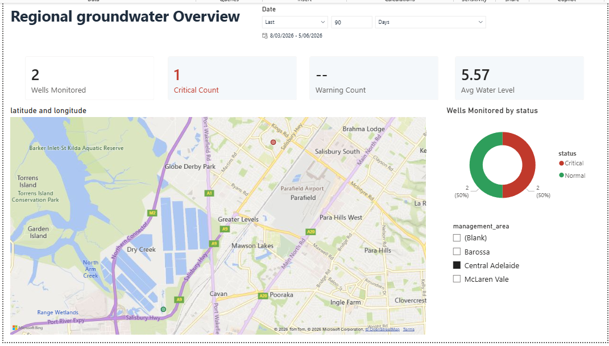
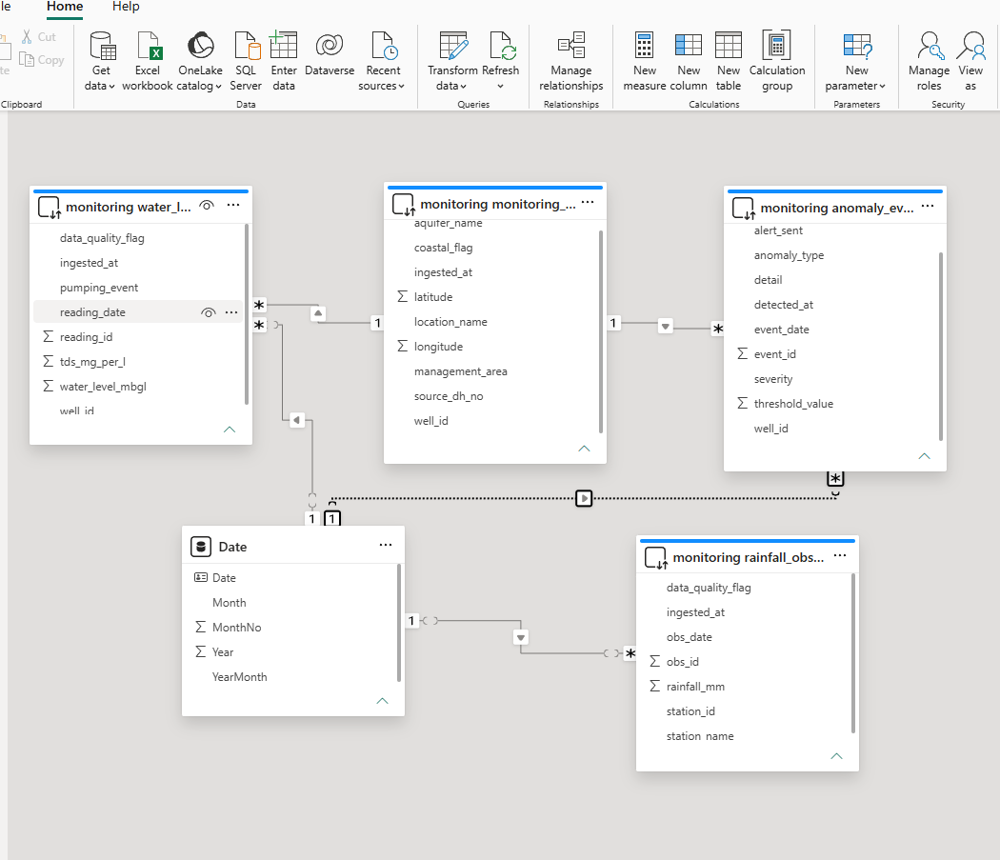
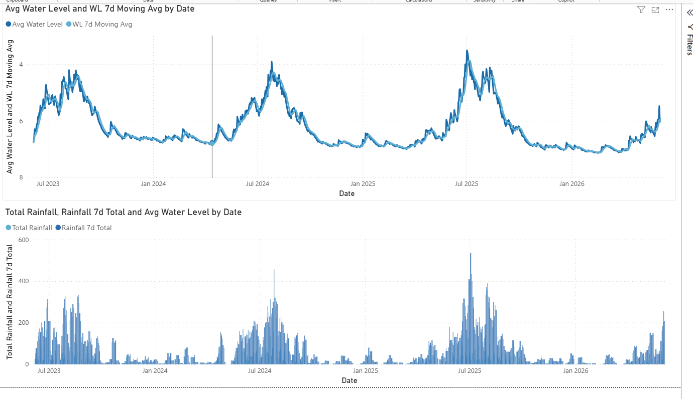
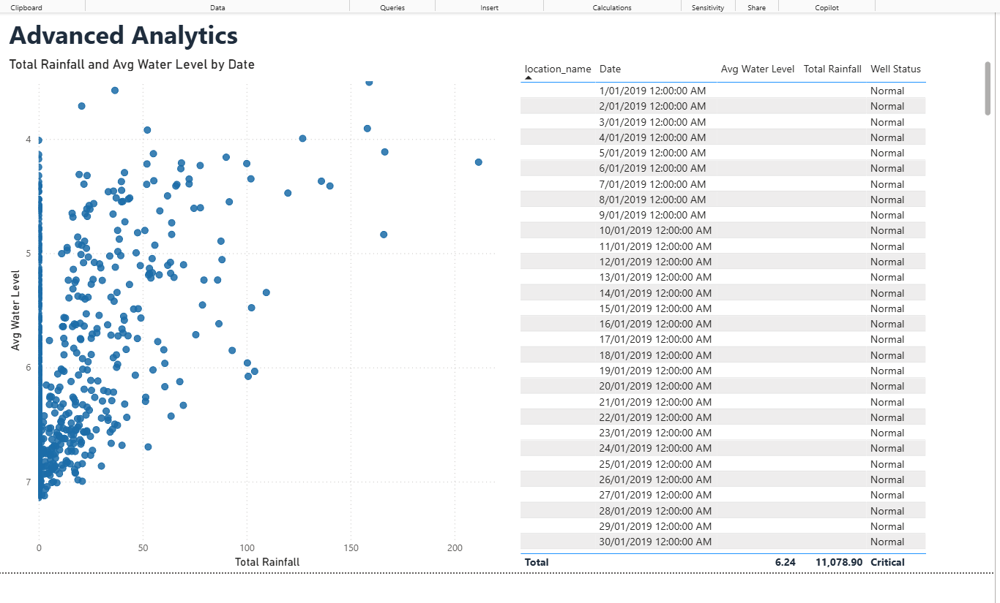
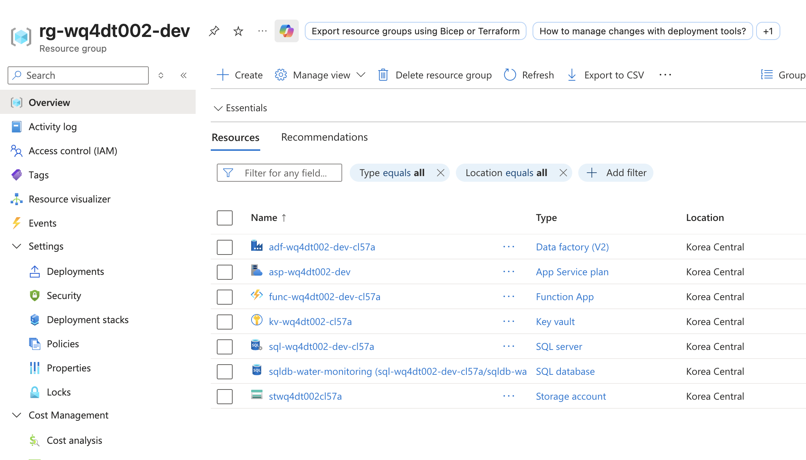
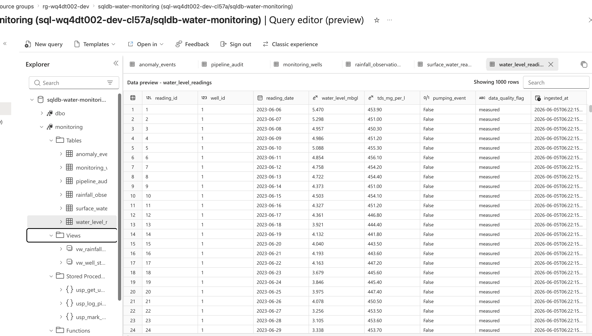

# Regional Water Quality & Groundwater Monitoring Pipeline

An end-to-end, cloud-native platform that monitors regional groundwater
systems — tracking how aquifers respond to rainfall, watching for salinity
intrusion along the coast, and turning a continuous stream of sensor readings
into decisions a human can act on.

It ingests publicly-licensed South Australian groundwater, rainfall and
surface-water data through an **Azure Data Factory** pipeline into **Azure
SQL**, scores it for anomalies with an **Azure Function**, raises alerts via
**Logic Apps**, and presents everything in a four-view **Power BI** decision
dashboard. The whole stack is provisioned with **Terraform**.

> 📄 **Full write-up:** [`docs/PROJECT_REPORT.md`](docs/PROJECT_REPORT.md) ·
> 🧠 **Detection methodology:** [`docs/anomaly_methodology.md`](docs/anomaly_methodology.md) ·
> 📊 **Dashboard build guide:** [`powerbi/DASHBOARD_GUIDE.md`](powerbi/DASHBOARD_GUIDE.md)

---



---

## Architecture

```
[ Public data sources ]
 Groundwater REST API (levels + salinity) ──┐
 Climate API (daily rainfall)               ├─► Azure Data Factory ─► Azure SQL Database
 Surface-water portal (river/reservoir)     ┘     (daily ETL)              │
                                                                           │
                                              Azure Function (anomaly scorer, daily)
                                                          │
                                              Azure SQL · anomaly_events
                                                          │
                                   ┌──────────────────────┴───────────────────────┐
                                   ▼                                               ▼
                          Power BI dashboard                       Logic Apps → Email / Teams
                       (DirectQuery to Azure SQL)                  (CRITICAL alerts)
```

**Tech stack:** Terraform · Azure SQL Database · Azure Data Factory · Azure
Functions (Python) · Azure Key Vault · Azure Logic Apps · Power BI ·
Python (pandas / SQLAlchemy) · GitHub Actions CI/CD.

---

## Dashboard

The report connects to Azure SQL with **DirectQuery**, so every visual reflects
the live cloud warehouse.

### Data model
A clean star-style model: `monitoring_wells` and a `Date` dimension fanning out
to the water-level, rainfall and anomaly fact tables.



### Groundwater trend & rainfall–recharge
Water level with a 7-day moving average (axis inverted so deeper reads lower),
above daily rainfall. The seasonal winter rainfall peaks line up with the
water-table recovery — the recharge response made visible.



### Advanced analytics
Rainfall-versus-water-level scatter and a per-well status table that rolls up
to the current Normal / Watch / Critical classification.



---

## Live on Azure

The full stack was provisioned with Terraform and the curated data loaded into
Azure SQL, so Power BI queries it live via DirectQuery.



*(Resource group `rg-wq4dt002-dev`: Azure SQL, Data Factory, Function App,
Storage, Key Vault.)*

The curated data, live in Azure SQL:



---

## Anomaly detection

Three transparent, explainable detectors — each encoding a piece of
hydrogeological domain knowledge. Full rationale in
[`docs/anomaly_methodology.md`](docs/anomaly_methodology.md); verified by
unit tests in [`tests/test_detectors.py`](tests/test_detectors.py).

| Detector | Signal | Method |
|----------|--------|--------|
| **Rapid Level Change** | Sudden water-level move | Z-score vs a trailing 7-day baseline (±2σ → WARNING, ±3σ → CRITICAL) |
| **Low Recharge Response** | No rebound after rain | After a 7-day rainfall total > 20 mm, expect a ≥ 0.10 m rise within 14 days |
| **Salinity Intrusion Risk** | Sustained rising TDS | OLS trend over 30 days (slope > 1 mg/L/day, R² ≥ 0.5); coastal wells escalate to CRITICAL |

---

## Data sources

| Source | Data | Licence |
|--------|------|---------|
| State groundwater portal | Drillhole water levels (mBGL) & salinity (TDS) | Creative Commons Attribution |
| National climate service | Daily rainfall by station | Open / CC |
| Surface-water portal | Near-real-time river & reservoir levels | Open |

> ℹ️ **Data note.** The pipeline is designed to ingest the real public sources
> above. The dashboard and Azure database shown here are demonstrated with
> **synthetic data of identical schema** (see
> [`scripts/generate_sample_data.py`](scripts/generate_sample_data.py)), so the
> project is fully reproducible offline. Full provenance is documented in
> [`docs/PROJECT_REPORT.md`](docs/PROJECT_REPORT.md#data-provenance).

---

## Try it offline (no Azure needed)

```bash
pip install -r requirements.txt
python scripts/generate_sample_data.py      # hydrologically plausible synthetic data
python scripts/run_detectors_offline.py     # runs the real detectors over it
pytest tests/ -v                            # verify the detection logic (6 tests)
```

To reproduce the cloud setup, see
[`infra/README.md`](infra/README.md) and the deployment section of the
[project report](docs/PROJECT_REPORT.md#azure-deployment). Running cost is
~AUD 5–10/month; remember `terraform destroy` when finished.

---

## Repository structure

```
azure-water-quality-pipeline/
├── infra/            # Terraform IaC (Azure SQL, ADF, Function, Key Vault)
├── ingestion/        # Python source clients + Azure SQL loader
├── functions/        # Azure Function: 3-detector anomaly scoring
├── adf/              # Data Factory linked services, pipeline, trigger
├── logic_apps/       # CRITICAL-event email/Teams alert workflow
├── sql/              # Schema, views, audit table, stored procedures
├── powerbi/          # .pbix dashboard, build guide, screenshots
├── scripts/          # Sample-data generator, offline runner, Azure loaders
├── tests/            # Unit tests for the detectors
├── docs/             # Project report + anomaly methodology
└── .github/          # CI (lint + test + tf validate) and Deploy workflows
```
